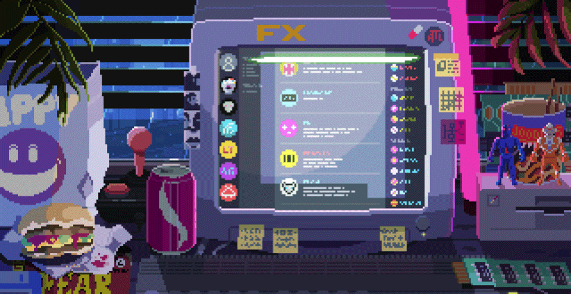

# 👋 Heyo! I'm Ankhgerel. 

<picture>
 
  <source media="(prefers-color-scheme: light)" srcset="https://raw.githubusercontent.com/tobiasmeyhoefer/tobiasmeyhoefer/output/github-snake.svg" />
  
</picture>

  

 

🌐 Currently building my own [personal website](https://your-website-link.com)  
🎓 Studying Information Technology at the National University of Mongolia (NUM)  
💻 Learning and experimenting with web development and tech projects  
📚 Exploring new tools, frameworks, and creative ideas  
🚀 On a mission to turn code into impact

<h3 align="left">🌐 My Hackerrank profile</h3>

  

<h3 align="left">🏆 Certificates</h3>

  <a href="https://www.hackerrank.com/certificates/39582414b23a" target="_blank">
    View my HackerRank Certificate
    <a href="https://www.hackerrank.com/certificates/9f62edccb923" target="_blank">
    View my HackerRank Certificate
  </a>

<picture>
 
  <source media="(prefers-color-scheme: light)" srcset="https://raw.githubusercontent.com/tobiasmeyhoefer/tobiasmeyhoefer/output/github-snake.svg" />
  
</picture>

# ⚙️ Tools & Technologies
                              
# 📊 GitHub Stats

  
  

<!-- Proudly created with GPRM ( https://gprm.itsvg.in ) -->